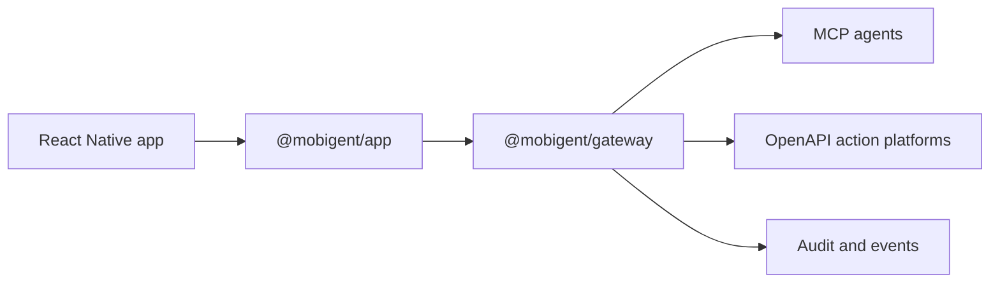

# Mobigent

Mobigent is an SDK for exposing mobile app capabilities to AI agents without handing over the UI.

The app registers:

- actions for things it can do
- resources for things it can read
- components for screens or UI surfaces it can focus
- events for things it can report
- confirmations for user-approved sensitive work

Agents connect through a gateway using MCP or OpenAPI. The app remains the source of truth for business logic, permissions, and user approval.

## Architecture

