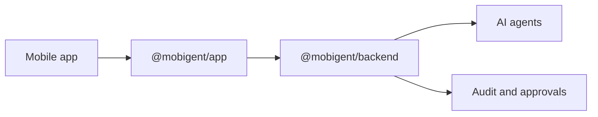

# Mobigent

Mobigent is an SDK for letting AI agents call approved mobile app functions without handing over the UI.

Start with two packages:

- `@mobigent/app` in the mobile app
- `@mobigent/backend` in the backend

The app exposes normal functions such as `expense.list` and `expense.create`. The backend waits for the app and turns that feature into a tiny object with `feature("expense")`, so server code can call `expense.create(input)` like ordinary backend code. Mobigent handles connection setup, validation, approval, retries, agent setup, and audit events.

Read gateway, MCP, OpenAPI, and provider docs after the simple app/backend loop works.

## Architecture

