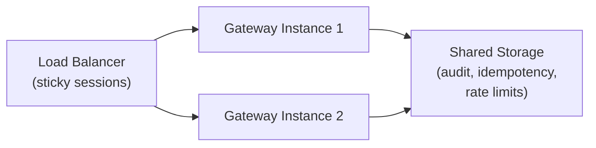

# Scaling & Deployment Guide

## Single Gateway (Default)

A single Mobigent gateway instance can handle many app sessions and tool calls. This is the recommended starting point for most deployments.

**Capacity guidelines for one Node.js process (2 vCPU, 2 GB RAM):**

| Metric                 | Approximate Limit |
| ---------------------- | ----------------- |
| Connected app sessions | 100–500           |
| Tools per manifest     | 100–500           |
| Concurrent tool calls  | 50–200            |
| SSE clients            | 50–100            |
| Audit events in memory | 500–1000          |

Limits depend on tool call latency, input/output sizes, and cleanup configuration.

## When to Scale

Consider scaling when:

- App sessions exceed single-instance memory
- Tool call latency increases under concurrency
- High availability is required (no single point of failure)
- Geographically distributed app sessions need lower latency

## Horizontal Scaling

Mobigent supports horizontal scaling with sticky WebSocket routing.

### Architecture



### Sticky Sessions

WebSocket connections must be routed to the same gateway instance for the lifetime of the app session. Use:

- **Kubernetes:** Session affinity on the Service (`sessionAffinity: ClientIP`)
- **AWS ALB:** Application-based sticky cookies
- **nginx:** `ip_hash` or `sticky` module
- **HAProxy:** `stick-table` with `stick on`

HTTP API calls do NOT require sticky sessions. Any instance can serve `/tools/:name/call` for any connected app.

### Shared State Requirements

To scale beyond a single instance, the following state must be shared:

| State                   | Current      | Shared Required?       | Solution                               |
| ----------------------- | ------------ | ---------------------- | -------------------------------------- |
| App session → WebSocket | Per-instance | Yes (routing)          | Sticky sessions                        |
| Tool registry           | Per-instance | Eventual               | Sync via app connect/disconnect events |
| Idempotency records     | Per-instance | Yes (for durability)   | Shared `IdempotencyStore`              |
| Rate-limit buckets      | Per-instance | Yes (for accuracy)     | Shared `RateLimitStore`                |
| Audit events            | Per-instance | Yes (for completeness) | Shared `AuditSink`                     |
| Metrics                 | Per-instance | No                     | Aggregate from all instances           |

### Shared Storage Implementations

The gateway storage interfaces (`AuditSink`, `IdempotencyStore`, `RateLimitStore`) are planned/in-progress extension points for plugging in shared backends:

- **Redis:** Good for idempotency and rate-limit state (atomic counters, TTL)
- **PostgreSQL:** Good for audit events and idempotency records
- **S3/GCS:** Good for audit log files (append-only)

Until those interfaces are wired into `BridgeGateway` constructor options, idempotency and rate limits remain per-instance.

## Deployment Topologies

### Docker Compose (Dev/Test)

```yaml
services:
  gateway:
    build: .
    ports:
      - '8787:8787'
      - '8788:8788'
    environment:
      - MOBIGENT_ENV=production
      - MOBIGENT_AUTH_TOKEN=${MOBIGENT_AUTH_TOKEN}
      - MOBIGENT_HTTP_API_KEY=${MOBIGENT_HTTP_API_KEY}
```

### Kubernetes

```yaml
apiVersion: v1
kind: Service
metadata:
  name: mobigent-gateway
spec:
  sessionAffinity: ClientIP
  sessionAffinityConfig:
    clientIP:
      timeoutSeconds: 3600
  ports:
    - name: ws
      port: 8787
    - name: http
      port: 8788
  selector:
    app: mobigent-gateway
---
apiVersion: apps/v1
kind: Deployment
metadata:
  name: mobigent-gateway
spec:
  replicas: 2
  selector:
    matchLabels:
      app: mobigent-gateway
  template:
    metadata:
      labels:
        app: mobigent-gateway
    spec:
      containers:
        - name: gateway
          image: mobigent-gateway:local
          ports:
            - containerPort: 8787
              name: ws
            - containerPort: 8788
              name: http
          env:
            - name: MOBIGENT_ENV
              value: 'production'
            - name: MOBIGENT_AUTH_TOKEN
              valueFrom:
                secretKeyRef:
                  name: mobigent-secrets
                  key: auth-token
          readinessProbe:
            httpGet:
              path: /ready
              port: 8788
            initialDelaySeconds: 5
            periodSeconds: 10
          livenessProbe:
            httpGet:
              path: /health
              port: 8788
            initialDelaySeconds: 10
            periodSeconds: 30
```

### Reverse Proxy (nginx)

```nginx
upstream mobigent_gateway {
    ip_hash;  # sticky WebSocket sessions
    server gateway1:8787;
    server gateway2:8787;
}

server {
    listen 443 ssl;
    server_name gateway.example.com;

    location / {
        proxy_pass http://mobigent_gateway;
        proxy_http_version 1.1;
        proxy_set_header Upgrade $http_upgrade;
        proxy_set_header Connection "upgrade";
        proxy_set_header Host $host;
        proxy_read_timeout 86400s;
    }
}
```

## Graceful Shutdown

The gateway handles SIGTERM:

1. Stop accepting new HTTP connections
2. Stop accepting new WebSocket connections
3. Complete in-flight tool calls (up to configured timeout, default 15s)
4. Close all WebSocket sessions with a close frame
5. Flush audit sink
6. Emit `gateway.stopped` audit event
7. Exit

**Kubernetes pod termination:** Set `terminationGracePeriodSeconds` to at least `max tool call timeout + 5 seconds`.

## Performance Budgets

| Operation                      | Target (P50) | Target (P99) |
| ------------------------------ | ------------ | ------------ |
| Manifest registration          | < 50ms       | < 200ms      |
| Tool list                      | < 10ms       | < 50ms       |
| Tool call overhead (excl. app) | < 5ms        | < 50ms       |
| Health check                   | < 5ms        | < 20ms       |
| Audit write (memory)           | < 1ms        | < 10ms       |

Memory per connected app session: ~50-100 KB (varies with tool count and manifest size).

## Monitoring at Scale

When running multiple instances:

- Aggregate Prometheus metrics across instances
- Include `instance` label to distinguish gateway replicas
- Monitor sticky session imbalance
- Track audit sink latency and failures per instance
- Use distributed tracing (OpenTelemetry) to follow requests across instances
