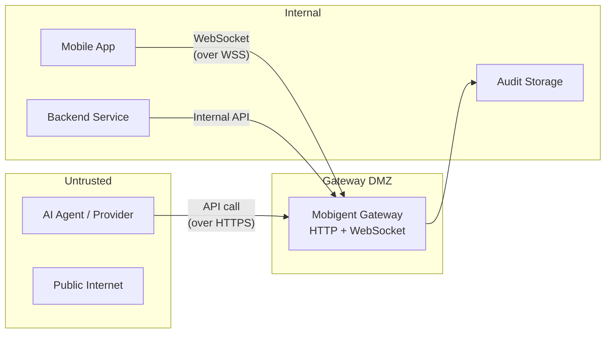

# Threat Model

This document describes the security threat model for Mobigent deployments. It covers assets, trust boundaries, actors, abuse cases, current controls, and identified gaps.

## Assets

| Asset                                               | Sensitivity                                            | Location                   |
| --------------------------------------------------- | ------------------------------------------------------ | -------------------------- |
| App auth token (`MOBIGENT_AUTH_TOKEN`)              | High — allows app to connect to gateway                | Gateway + app config       |
| HTTP API keys (`MOBIGENT_HTTP_API_KEY`, agent keys) | High — allows agent to call tools                      | Gateway + provider config  |
| Manifest signing secret                             | High — prevents forged manifests                       | Gateway config             |
| Tool call inputs/results                            | Medium-High — may contain PII or business data         | Gateway memory, audit logs |
| Audit events                                        | Medium — business-sensitive operational data           | Gateway memory, JSONL file |
| Connected session state                             | Medium — reveals what apps are connected               | Gateway memory             |
| OpenAPI schema                                      | Low-Medium — reveals available tools and their schemas | `/openapi.json` endpoint   |
| Agent profiles and policies                         | Low-Medium — reveals security configuration            | Gateway config             |

## Trust Boundaries

### Trust Boundary 1: Agent → Gateway

- **Protocol:** HTTPS (HTTP API)
- **Authentication:** HTTP API key (bearer token or `x-mobigent-api-key` header)
- **Authorization:** Agent profiles, tool policies, rate limits

### Trust Boundary 2: Mobile App → Gateway

- **Protocol:** WSS (WebSocket secure)
- **Authentication:** App auth token
- **Authorization:** App ID allowlist, manifest signing

### Trust Boundary 3: Gateway → Audit Storage

- **Protocol:** File system or external service
- **Data:** Audit events (redacted)
- **Protection:** File permissions, encryption at rest

## Actors

| Actor                        | Trust Level  | Description                                              |
| ---------------------------- | ------------ | -------------------------------------------------------- |
| App developer                | Trusted      | Configures app functions, manages app identity           |
| Backend operator             | Trusted      | Deploys gateway, manages config and secrets              |
| AI agent / provider          | Untrusted    | Calls tools through the gateway API                      |
| Mobile app (runtime)         | Semi-trusted | Authenticated app connecting over WebSocket              |
| Malicious app                | Untrusted    | Attempts to connect without auth or with forged identity |
| Attacker (network)           | Untrusted    | Can observe or tamper with network traffic               |
| Attacker (compromised token) | Untrusted    | Has obtained a valid auth token or API key               |

## Abuse Cases

### AC-1: Malicious App Connection

**Scenario:** An attacker runs an app that attempts to connect to the gateway without authorization.

**Controls:**

- `MOBIGENT_AUTH_TOKEN` required in production
- `MOBIGENT_ALLOWED_APP_IDS` restricts which app IDs can connect
- Manifest signing verifies the app's capability manifest

**Gaps:**

- Manifest signing requires both sides to be configured
- App ID allowlist is optional

### AC-2: Malicious Agent / Leaked API Key

**Scenario:** An attacker obtains a valid HTTP API key and calls tools without authorization.

**Controls:**

- HTTP API key or per-agent API key required
- Agent profiles can restrict tools per agent
- Rate limits prevent abuse
- Per-agent keys can be individually revoked

**Gaps:**

- No automatic key rotation
- No anomaly detection on tool call patterns
- Key revocation requires gateway restart

### AC-3: Overly Broad Capability Exposure

**Scenario:** An app registers capabilities that are broader than intended (e.g., a write where a read was expected).

**Controls:**

- App functions are explicitly defined in code
- Read/write classification based on function naming
- `write()` helper requires explicit confirmation
- Confirmation flow in app UI

**Gaps:**

- Classification relies on naming conventions (`list`, `get`, `read`)
- No automated capability review tooling

### AC-4: Prompt Injection into Tool Inputs

**Scenario:** An AI agent includes malicious content in tool call inputs.

**Controls:**

- Input validation via JSON Schema on tool definitions
- App-side sanitization available
- Confirmation UI shows inputs before approval

**Gaps:**

- Schema validation is optional per tool
- No content-security scanning of inputs

### AC-5: Replay Attack

**Scenario:** An attacker replays a captured tool call request.

**Controls:**

- Idempotency keys deduplicate calls
- Rate limits prevent high-frequency replays
- WSS with TLS encrypts WebSocket traffic

**Gaps:**

- Idempotency is stateful and resets on restart (without durable store)
- No request timestamp/nonce validation

### AC-6: Rate-Limit Bypass

**Scenario:** An attacker distributes calls across multiple agent IDs or tools to avoid per-tool rate limits.

**Controls:**

- Per-tool rate limits (per minute)
- Agent profiles can restrict tools
- Per-agent API keys provide identity

**Gaps:**

- No global rate limit across all tools
- Rate limits reset on gateway restart (without durable store)
- No per-IP or per-session rate limiting

### AC-7: Audit Exfiltration

**Scenario:** An attacker with access to audit logs extracts sensitive business data.

**Controls:**

- Default secret redaction (tokens, keys, passwords)
- Configurable additional redaction keys
- Audit logs marked as sensitive in docs

**Gaps:**

- Audit events may contain tool names and app IDs
- No encryption-at-rest guidance for audit files
- No retention/deletion automation

### AC-8: OpenAPI Schema Exposure

**Scenario:** An attacker reads `/openapi.json` to discover available tools and their input schemas.

**Controls:**

- OpenAPI endpoint policy: can be `protected` or `disabled` in production
- Tool list requires auth when HTTP API key is configured

**Gaps:**

- OpenAPI endpoint is `public` by default in development
- Tool schemas may reveal business logic

### AC-9: Inspector Exposure

**Scenario:** An attacker accesses `/inspect` to view connected apps, tools, audit events, and metrics.

**Controls:**

- Inspector can be `disabled` or `protected` in production
- Inspector mode defaults to `disabled` in production

**Gaps:**

- Inspector is `enabled` by default in development
- No authentication is required for inspector in development mode

### AC-10: Gateway Compromise via Dependency

**Scenario:** A vulnerability in a gateway dependency allows code execution.

**Controls:**

- npm audit available
- GitHub Dependabot/Security advisories

**Gaps:**

- No automated dependency review in CI (CodeQL, dependency review)
- No SBOM generation
- No Docker image scanning

## Security Controls Summary

### Implemented

- [x] App auth token (MOBIGENT_AUTH_TOKEN)
- [x] HTTP API key (bearer or x-mobigent-api-key)
- [x] Per-agent API keys
- [x] App ID allowlist
- [x] Manifest signing (HMAC)
- [x] Agent profiles (allowed/denied tools, read-only, max risk)
- [x] Rate limiting (per-tool per-minute)
- [x] Idempotency keys
- [x] Audit redaction (default + configurable keys)
- [x] CORS restrictions
- [x] JSON body size limits
- [x] Request timeouts
- [x] Input validation via JSON Schema
- [x] Structured logging (secret-safe)
- [x] Endpoint policy (public/protected/disabled)
- [x] Inspector access control (enabled/disabled/protected/internal)
- [x] Production mode safety checks

### Recommended (P1)

- [ ] CodeQL workflow for TypeScript
- [ ] Dependency review on PRs
- [ ] Scheduled npm audit
- [ ] Docker image scanning
- [ ] SBOM generation
- [ ] Secret scanning at repository level
- [ ] Automated key rotation guidance
- [ ] Global rate limiting
- [ ] Request nonce/timestamp validation
- [ ] Durable idempotency (survives restart)

### Future (P2)

- [ ] OIDC/JWT for operator APIs
- [ ] Scoped API tokens
- [ ] Audit encryption at rest
- [ ] Anomaly detection on tool call patterns
- [ ] Automated capability review tooling
- [ ] Compliance-ready audit exports

## Security Review Signoff

- [ ] Threat model reviewed by: _______________
- [ ] Date: _______________
- [ ] Findings: _______________________________________________
